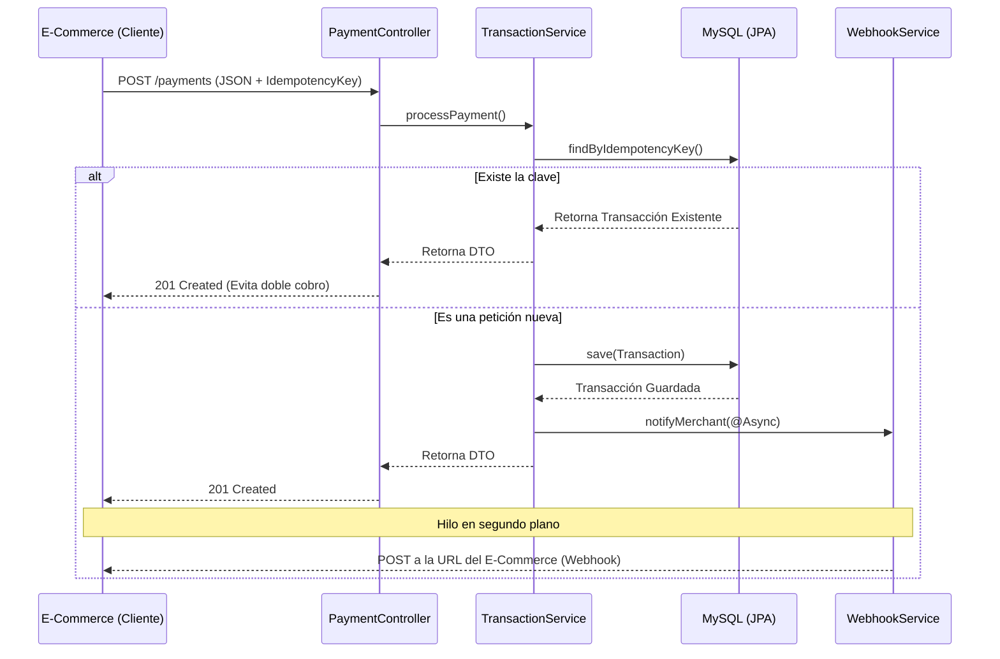

# Core-Pagos: Motor Transaccional REST

Este proyecto es el backend central de una pasarela de pagos simulada (similar a Stripe o Mercado Pago). El enfoque principal del desarrollo no es solo procesar peticiones HTTP, sino aplicar patrones de diseño empresarial y arquitecturas resilientes para garantizar la integridad financiera de las transacciones.

## Arquitectura y Decisiones de Diseño

El sistema fue construido evolucionando desde JDBC puro hacia Spring Data JPA, manteniendo una separación estricta de responsabilidades (Clean Architecture). 

Se implementaron las siguientes características críticas:

* **Control de Idempotencia:** Implementación del patrón `Idempotency-Key` en los encabezados HTTP. El sistema garantiza que una falla de red o un reintento del cliente no resulte en un cobro duplicado en la base de datos.
* **Simulación de Cumplimiento PCI-DSS:** El módulo de tokenización (`TokenService`) destruye en memoria los datos sensibles (PAN completo y CVV) inmediatamente después de procesarlos, persistiendo únicamente un token seguro y los últimos 4 dígitos.
* **Procesamiento Asíncrono (Webhooks):** Uso de hilos en segundo plano (`@Async`) para simular notificaciones push a los servidores de los comercios (E-commerce) sin bloquear el hilo HTTP de respuesta al cliente (Non-blocking design).
* **Ingeniería Defensiva:** Validación a nivel de campo (Field-Level Validation) mediante `jakarta.validation` y un manejador global de excepciones (`@ControllerAdvice`) que intercepta errores y devuelve payloads JSON estandarizados.

## Stack Tecnológico

* **Lenguaje:** Java 17
* **Framework:** Spring Boot 3.2
* **Persistencia:** Spring Data JPA / Hibernate (Desfase de impedancia relacional-objeto)
* **Base de Datos:** MySQL 8
* **Herramientas:** Lombok (Reducción de boilerplate), Maven
* **UI de Pruebas:** Thymeleaf + HTML5/JS nativo (Para simulación de integración frontend sencilla)

## Instalación y Despliegue Local

### 1. Requisitos Previos
* Java 17 instalado en tu máquina.
* Servidor MySQL corriendo en el puerto `3306`.

### 2. Configuración de Base de Datos
Crea la base de datos ejecutando el siguiente comando en tu gestor SQL:
 -Ver en core-pagos/database/schema.sql
CREATE DATABASE pasarela_pagos;

### 3. Configuración de Credenciales
Cambia 'TU_USUARIO' y 'TU_PASSWORD' con los datos de tu bd respectivamente.
* spring.datasource.username=TU_USUARIO
* spring.datasource.password=TU_PASSWORD

### 4. Ejecución
Inicia la aplicación ejecutando la clase principal PasarelaApplication.java o mediante Maven:
* mvn spring-boot:run

El servidor va a estar escuchando en http://localhost:8080

### Extra. Pruebas
Puedes probar la API de dos maneras:

* Navegando a http://localhost:8080/ para acceder a la interfaz gráfica de simulación (Checkout UI).

* Utilizando el archivo test-api.http incluido en la raíz del proyecto para ejecutar pruebas automatizadas directas desde VS Code usando la extensión REST Client.

### Diagrama de Arquitectura

